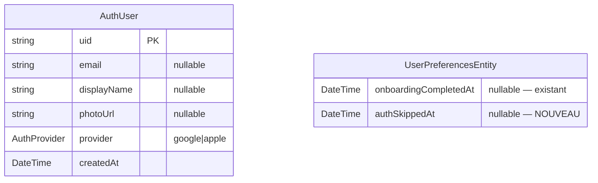

# feat: Firebase Authentication (Google + Apple) avec mode anonyme et gating paywall

**Date** : 2026-04-16
**Type** : ✨ feature
**Scope** : multi-couches (domain + data + presentation + routing + native iOS)
**Estimation complexité** : Standard (~12 fichiers nouveaux, ~6 modifs)

---

## 1. Résumé

Mettre en place l'authentification utilisateur via **Firebase Auth** avec deux providers OAuth : **Google Sign-In** et **Sign in with Apple**. L'authentification est **optionnelle au démarrage** (l'utilisateur peut continuer en mode anonyme) mais devient **obligatoire avant tout achat d'abonnement**. L'écran d'auth est le **premier écran présenté** au lancement (avant l'onboarding) pour les nouveaux utilisateurs.

L'auth sert uniquement à l'**identité** dans cette première itération : aucune donnée locale (cards, screenshots, préférences) n'est synchronisée vers Firestore. Le sync cloud est explicitement hors scope.

---

## 2. Motivation

| Pourquoi maintenant | Bénéfice attendu |
|---|---|
| Préparer le terrain pour l'abonnement (paywall) qui doit lier la subscription RevenueCat à un identifiant utilisateur stable | Subscriptions cross-device + restauration achats fiable |
| Anticiper le futur sync cloud sans avoir à migrer de schéma plus tard | Coût d'une 2ᵉ itération réduit |
| Permettre les analytics user-level (pas juste device-level) | Insights segmentation : free vs subscriber, retention par cohorte signup |
| Conformité App Store : Sign in with Apple est requis dès qu'un autre login social est présent | Pas de rejet review |

---

## 3. Acceptance criteria

### Fonctionnel

- [ ] Au premier lancement, l'AuthScreen s'affiche après le splash (avant l'onboarding)
- [ ] L'utilisateur peut se connecter avec **Google** (compte Google natif iOS/Android)
- [ ] L'utilisateur peut se connecter avec **Apple** (sheet natif Sign in with Apple sur iOS, fallback OAuth web sur Android)
- [ ] L'utilisateur peut **skipper** ("Continuer sans compte") → poursuit en anonyme
- [ ] Si l'utilisateur est déjà connecté (Firebase Auth a un currentUser persisté), l'AuthScreen est sauté
- [ ] Si l'utilisateur a déjà skippé une fois et n'est pas connecté, l'AuthScreen est sauté aux lancements suivants
- [ ] Sur le **paywall**, si l'utilisateur tente d'acheter sans être connecté, il est redirigé vers AuthScreen (avec un mode "obligatoire" : pas de bouton skip)
- [ ] Une fois connecté depuis le paywall, retour automatique au paywall pour finaliser l'achat
- [ ] Bouton "Se déconnecter" disponible dans Settings (déclenche `signOut`)
- [ ] L'auth state change est observable globalement via un provider Riverpod

### Non-fonctionnel

- [ ] Aucune dépendance directe à `firebase_auth` / `google_sign_in` / `sign_in_with_apple` dans la couche **presentation** ni **domain** (uniquement dans `data/services/`)
- [ ] L'AuthUser est sérialisable JSON (mappers + roundtrip testé)
- [ ] Tests unitaires couvrent : signin success, signin cancelled by user, signin network error, signout
- [ ] L'écran respecte le design system **CalmSurface** (gradients Aurora, squircle, glass)
- [ ] Pas de fuite de PII : seul `uid` Firebase + email (si scope accordé) sont loggés ; jamais de token / mdp / refresh token
- [ ] Crashlytics hooks reçoivent l'`uid` une fois signé (`setUserIdentifier`)
- [ ] Analytics events trackés : `auth_screen_viewed`, `auth_signin_started`, `auth_signin_succeeded`, `auth_signin_failed`, `auth_signin_skipped`, `auth_signout`

---

## 4. Architecture & approche

### 4.1 ERD — modèle de données



**Décision** : pas de table ObjectBox pour `AuthUser`. Firebase Auth persiste lui-même la session (Keychain iOS / EncryptedSharedPreferences Android). On dérive `AuthUser` à la volée depuis `firebase_auth.User` via un mapper.

`authSkippedAt` est ajouté à `UserPreferencesEntity` (entité freezed déjà existante) pour permettre au splash de savoir si l'utilisateur a déjà choisi le mode anonyme — sinon on lui re-pousserait l'AuthScreen à chaque relance.

### 4.2 Couches & dépendances

```
presentation/auth/screens  ──watch──▶  authViewModel
                                │
                                ├─watch──▶  authStateProvider (Stream<AuthUser?>)
                                └─call────▶  authServiceProvider (AuthService)
                                                       │
                                                       ▼
                                              FirebaseAuthService (data/)
                                                       │
                                                       ├──▶ FirebaseAuth
                                                       ├──▶ GoogleSignIn
                                                       └──▶ SignInWithApple
```

**Règle layer separation** : `domain/` ne référence aucun package externe sauf `freezed`. `presentation/` ne référence que `domain/` + widgets/tokens. Toute interaction avec les SDK natifs reste dans `data/`.

### 4.3 Flow de redirect au boot

```
SplashScreen
    │
    ├─ prefs = load()
    ├─ user = FirebaseAuth.currentUser  (synchrone, déjà persisté)
    │
    ├─ if (user != null)            → onboarding done ? → Home : Onboarding
    ├─ if (prefs.authSkippedAt!=null) → onboarding done ? → Home : Onboarding
    └─ else                          → AuthRoute  (mode optional)
```

### 4.4 Flow paywall gating

```
PaywallScreen.onTapSubscribe
    │
    ├─ user = ref.read(currentUserProvider)
    ├─ if (user != null)  → proceed RevenueCat purchase
    └─ else               → router.push(AuthRoute(required: true, returnTo: PaywallRoute))
                            (au signin success → router.replace(PaywallRoute))
```

---

## 5. Plan d'implémentation — fichier par fichier

> **Ordre d'exécution** strict : data layer d'abord (sans dépendances), puis domain, puis providers, puis presentation, puis routing, puis paywall, puis natif iOS, puis tests.

### Phase 1 — Dépendances

**Fichier** : `pubspec.yaml`

```yaml
  # Auth providers
  google_sign_in: ^6.2.1
  sign_in_with_apple: ^6.1.0
```

À ajouter dans la section Firebase existante. Lancer `fvm flutter pub get`.

### Phase 2 — Domain

**Fichier nouveau** : `lib/domain/enum/auth_provider.enum.dart`

```dart
enum AuthProvider { google, apple }
```

**Fichier nouveau** : `lib/domain/entities/auth_user.entity.dart`

```dart
@freezed
abstract class AuthUserEntity with _$AuthUserEntity {
  const factory AuthUserEntity({
    required String uid,
    required AuthProvider provider,
    required DateTime createdAt,
    String? email,
    String? displayName,
    String? photoUrl,
  }) = _AuthUserEntity;

  factory AuthUserEntity.fromJson(Map<String, dynamic> json) =>
      _$AuthUserEntityFromJson(json);
}
```

**Fichier nouveau** : `lib/domain/services/auth.service.dart`

```dart
abstract interface class AuthService {
  Stream<AuthUserEntity?> authStateChanges();
  AuthUserEntity? get currentUser;
  Future<AuthUserEntity> signInWithGoogle();
  Future<AuthUserEntity> signInWithApple();
  Future<void> signOut();
}

/// Erreurs typées que l'impl peut throw, pour que le view_model branche proprement.
sealed class AuthFailure implements Exception {
  const AuthFailure(this.message);
  final String message;
}
final class AuthCancelledByUser extends AuthFailure {
  const AuthCancelledByUser() : super('Authentication cancelled by user');
}
final class AuthNetworkFailure extends AuthFailure {
  const AuthNetworkFailure(super.message);
}
final class AuthProviderFailure extends AuthFailure {
  const AuthProviderFailure(super.message);
}
```

### Phase 3 — Data

**Fichier nouveau** : `lib/data/mappers/auth_user.mapper.dart`

```dart
extension FirebaseUserMapperX on User {
  AuthUserEntity toEntity({required AuthProvider provider}) {
    return AuthUserEntity(
      uid: uid,
      provider: provider,
      createdAt: metadata.creationTime ?? DateTime.now(),
      email: email,
      displayName: displayName,
      photoUrl: photoURL,
    );
  }
}
```

**Fichier nouveau** : `lib/data/services/auth_service.impl.dart`

```dart
final class FirebaseAuthService implements AuthService {
  FirebaseAuthService({
    FirebaseAuth? firebaseAuth,
    GoogleSignIn? googleSignIn,
  }) : _auth = firebaseAuth ?? FirebaseAuth.instance,
       _google = googleSignIn ?? GoogleSignIn(scopes: ['email']);

  final FirebaseAuth _auth;
  final GoogleSignIn _google;
  final Log _log = Log.named('FirebaseAuthService');

  // Le provider de la session courante n'est pas exposé par Firebase ;
  // on le reconstitue depuis User.providerData[0].providerId.
  AuthProvider _providerOf(User user) => switch (user.providerData.firstOrNull?.providerId) {
        'google.com' => AuthProvider.google,
        'apple.com' => AuthProvider.apple,
        _ => AuthProvider.google, // fallback safe
      };

  @override
  AuthUserEntity? get currentUser =>
      _auth.currentUser?.toEntity(provider: _providerOf(_auth.currentUser!));

  @override
  Stream<AuthUserEntity?> authStateChanges() => _auth.authStateChanges().map(
        (User? u) => u?.toEntity(provider: _providerOf(u)),
      );

  @override
  Future<AuthUserEntity> signInWithGoogle() async {
    try {
      final GoogleSignInAccount? google = await _google.signIn();
      if (google == null) throw const AuthCancelledByUser();
      final GoogleSignInAuthentication auth = await google.authentication;
      final OAuthCredential cred = GoogleAuthProvider.credential(
        accessToken: auth.accessToken,
        idToken: auth.idToken,
      );
      final UserCredential result = await _auth.signInWithCredential(cred);
      return result.user!.toEntity(provider: AuthProvider.google);
    } on FirebaseAuthException catch (e) {
      throw AuthProviderFailure('Firebase: ${e.code}');
    } on PlatformException catch (e) {
      // network_error, sign_in_failed, etc.
      throw AuthNetworkFailure('Platform: ${e.code}');
    }
  }

  @override
  Future<AuthUserEntity> signInWithApple() async {
    try {
      final AuthorizationCredentialAppleID apple =
          await SignInWithApple.getAppleIDCredential(
        scopes: <AppleIDAuthorizationScopes>[
          AppleIDAuthorizationScopes.email,
          AppleIDAuthorizationScopes.fullName,
        ],
      );
      final OAuthCredential cred = OAuthProvider('apple.com').credential(
        idToken: apple.identityToken,
        accessToken: apple.authorizationCode,
      );
      final UserCredential result = await _auth.signInWithCredential(cred);
      // Apple ne renvoie le displayName qu'à la 1ʳᵉ connexion ; on le persiste.
      if (apple.givenName != null && result.user!.displayName == null) {
        await result.user!.updateDisplayName(
          '${apple.givenName} ${apple.familyName ?? ''}'.trim(),
        );
      }
      return result.user!.toEntity(provider: AuthProvider.apple);
    } on SignInWithAppleAuthorizationException catch (e) {
      if (e.code == AuthorizationErrorCode.canceled) {
        throw const AuthCancelledByUser();
      }
      throw AuthProviderFailure('Apple: ${e.code.name}');
    } on FirebaseAuthException catch (e) {
      throw AuthProviderFailure('Firebase: ${e.code}');
    }
  }

  @override
  Future<void> signOut() async {
    await Future.wait(<Future<void>>[
      _auth.signOut(),
      _google.signOut(),
    ]);
  }
}
```

### Phase 4 — Providers

**Fichier nouveau** : `lib/core/providers/auth.provider.dart`

```dart
final Provider<AuthService> authServiceProvider = Provider<AuthService>((Ref ref) {
  return FirebaseAuthService();
});

final StreamProvider<AuthUserEntity?> authStateProvider =
    StreamProvider<AuthUserEntity?>((Ref ref) {
  return ref.watch(authServiceProvider).authStateChanges();
});

/// Synchronous access — nullable. Pour le gating paywall.
final Provider<AuthUserEntity?> currentUserProvider = Provider<AuthUserEntity?>((Ref ref) {
  return ref.watch(authStateProvider).valueOrNull;
});
```

**Fichier modifié** : `lib/core/providers/service_providers.dart`
→ Aucune modif si `auth.provider.dart` est séparé. (Recommandé pour séparation de concerns.)

### Phase 5 — UserPreferences (extension)

**Fichier modifié** : `lib/domain/entities/user_preferences.entity.dart`

```dart
// Ajouter dans le @factory :
DateTime? authSkippedAt,
```

**Fichiers modifiés (générés par freezed)** :
- `user_preferences.entity.freezed.dart` (auto-régénéré par build_runner)

**Fichier modifié** : `lib/data/model/local/user_preferences.local.model.dart`
→ Ajouter colonne `authSkippedAt` (DateTime?, ObjectBox @Property nullable)

**Fichier modifié** : `lib/data/mappers/user_preferences.mapper.dart`
→ Ajouter le mapping `authSkippedAt` ↔ entité

**ObjectBox** : pas besoin de migration explicite, ObjectBox gère l'ajout de propriété nullable automatiquement.

### Phase 6 — Presentation : feature `auth/`

**Fichier nouveau** : `lib/features/auth/presentation/screens/auth.state.dart`

```dart
@freezed
abstract class AuthScreenState with _$AuthScreenState {
  const factory AuthScreenState({
    @Default(AuthScreenStatus.idle) AuthScreenStatus status,
    AuthFailure? error,
  }) = _AuthScreenState;
}

enum AuthScreenStatus { idle, signingInGoogle, signingInApple, success }
```

**Fichier nouveau** : `lib/features/auth/presentation/screens/auth.view_model.dart`

```dart
@riverpod
class AuthViewModel extends _$AuthViewModel {
  @override
  AuthScreenState build() => const AuthScreenState();

  Future<bool> signInWithGoogle() async {
    state = state.copyWith(status: AuthScreenStatus.signingInGoogle, error: null);
    try {
      final AuthUserEntity user = await ref.read(authServiceProvider).signInWithGoogle();
      ref.read(analyticsServiceProvider).track(AnalyticsEvent.authSigninSucceeded, properties: {'provider': 'google'});
      // Bind to Crashlytics
      FirebaseCrashlytics.instance.setUserIdentifier(user.uid);
      state = state.copyWith(status: AuthScreenStatus.success);
      return true;
    } on AuthCancelledByUser {
      state = state.copyWith(status: AuthScreenStatus.idle);
      return false;
    } on AuthFailure catch (e) {
      ref.read(analyticsServiceProvider).track(AnalyticsEvent.authSigninFailed, properties: {'provider': 'google', 'reason': e.message});
      state = state.copyWith(status: AuthScreenStatus.idle, error: e);
      return false;
    }
  }

  Future<bool> signInWithApple() async { /* mirror google */ }

  Future<void> skip() async {
    await ref.read(userPreferencesRepositoryProvider).updateField(authSkippedAt: DateTime.now());
    ref.read(analyticsServiceProvider).track(AnalyticsEvent.authSigninSkipped);
  }
}
```

**Fichier nouveau** : `lib/features/auth/presentation/screens/auth.screen.dart`

Layout suivant le pattern `_OBHero` de l'onboarding :

```dart
@RoutePage()
class AuthScreen extends ConsumerWidget {
  const AuthScreen({this.required = false, super.key});
  /// Si true, masque le bouton "Continuer sans compte" (gating paywall).
  final bool required;

  @override
  Widget build(BuildContext context, WidgetRef ref) {
    final state = ref.watch(authViewModelProvider);
    return Scaffold(
      body: GradientBackground(
        child: SafeArea(
          child: Padding(
            padding: const EdgeInsets.all(CalmSpace.s7),
            child: Column(
              children: [
                const Spacer(flex: 2),
                const BeedleIconAsset(size: 96), // logo Dot-b
                const Gap(CalmSpace.s7),
                Text(LocaleKeys.auth_title.tr(), style: textTheme.displaySmall),
                const Gap(CalmSpace.s4),
                Text(LocaleKeys.auth_subtitle.tr(), style: textTheme.bodyLarge),
                const Spacer(flex: 3),
                _AppleButton(onTap: () async => _handleSignin(...)),
                const Gap(CalmSpace.s3),
                _GoogleButton(onTap: () async => _handleSignin(...)),
                if (!required) ...[
                  const Gap(CalmSpace.s5),
                  TextButton(
                    onPressed: () => _handleSkip(...),
                    child: Text(LocaleKeys.auth_skip.tr()),
                  ),
                ],
                const Gap(CalmSpace.s4),
                Text(LocaleKeys.auth_legal.tr(), style: textTheme.labelSmall),
              ],
            ),
          ),
        ),
      ),
    );
  }
}
```

**Composants visuels** :
- `_AppleButton` : `SquircleButton` noir avec icône Apple SVG (à ajouter `assets/icons/apple.svg`) — label "Continuer avec Apple"
- `_GoogleButton` : `SquircleButton` blanc avec icône Google SVG (à ajouter `assets/icons/google.svg`) — label "Continuer avec Google"
- Loader inline : si `state.status` ≠ `idle`, le bouton concerné affiche un `CircularProgressIndicator` à la place de l'icône
- Erreur : si `state.error` non null, snackbar discret en bas

**Conformité DESIGN.md** :
- ✅ `GradientBackground` (Aurora gradient)
- ✅ Pas de boutons rectangulaires : `SquircleButton`
- ✅ Pas de bleu/violet AI-slop : palette neutrals + Aurora
- ✅ Typographie : `displaySmall` pour titre, `bodyLarge` pour subtitle, `labelSmall` pour mention légale (CalmSurface scale)
- ✅ Pas d'emoji-celebration
- ✅ Logo Beedle centré (rappel branding cohérent avec splash)

### Phase 7 — Routing

**Fichier modifié** : `lib/foundation/routing/app_router.dart`

```dart
@override
List<AutoRoute> get routes => <AutoRoute>[
      AutoRoute(page: SplashRoute.page, initial: true),
      AutoRoute(page: AuthRoute.page),                    // NOUVEAU
      AutoRoute(page: OnboardingRoute.page),
      // ... reste inchangé
    ];
```

**Fichier modifié** : `lib/features/shared/presentation/screens/splash/splash.screen.dart`

```dart
Future<void> _route() async {
  final UserPreferencesEntity prefs = await ref.read(userPreferencesRepositoryProvider).load();
  final AuthUserEntity? user = ref.read(authServiceProvider).currentUser;

  await Future<void>.delayed(const Duration(milliseconds: 600));
  if (!mounted) return;

  // 1. Auth resolution : signed-in OU skipped explicitement
  final bool authResolved = user != null || prefs.authSkippedAt != null;

  if (!authResolved) {
    await context.router.replace(const AuthRoute());
    return;
  }

  // 2. Onboarding existant
  if (prefs.hasCompletedOnboarding) {
    await context.router.replace(const HomeRoute());
  } else {
    await context.router.replace(const OnboardingRoute());
  }
}
```

**Fichier modifié post-signin** : `auth.view_model.dart` ou navigation depuis l'écran lui-même
→ Au signin success ou skip, push `OnboardingRoute` (replace).

### Phase 8 — Paywall gating

**Fichier modifié** : `lib/features/paywall/presentation/screens/paywall.screen.dart`

Au tap du CTA "Subscribe", insérer un check :

```dart
Future<void> _onTapSubscribe(BuildContext context, WidgetRef ref) async {
  final AuthUserEntity? user = ref.read(currentUserProvider);
  if (user == null) {
    // Mode required : pas de skip
    await context.router.push(AuthRoute(required: true));
    // Au retour, si signed-in, retry purchase
    final AuthUserEntity? after = ref.read(currentUserProvider);
    if (after == null) return; // user a quand même reculé
  }
  // proceed RevenueCat purchase
  await ref.read(subscriptionRepositoryProvider).purchase(...);
}
```

### Phase 9 — Settings (signout)

**Fichier modifié** : `lib/features/settings/presentation/screens/settings.screen.dart`

Ajouter une section "Compte" :

- Si `currentUser == null` : tile "Se connecter" → navigate to AuthRoute
- Si `currentUser != null` : afficher email/displayName + tile "Se déconnecter" → call `signOut()`

### Phase 10 — Bootstrap

**Fichier modifié** : `lib/bootstrap.dart`

→ Aucune modif nécessaire ! `Firebase.initializeApp()` est déjà appelé. `FirebaseAuth.instance.currentUser` est dispo immédiatement après. La logique de redirect est dans le SplashScreen.

### Phase 11 — Native iOS (Google Sign-In URL scheme)

**Fichier modifié** : `ios/Runner/Info.plist`

Ajouter avant la balise `</dict>` finale :

```xml
<key>CFBundleURLTypes</key>
<array>
    <dict>
        <key>CFBundleTypeRole</key>
        <string>Editor</string>
        <key>CFBundleURLSchemes</key>
        <array>
            <!-- Coller la valeur REVERSED_CLIENT_ID lue depuis ios/Runner/GoogleService-Info.plist -->
            <string>com.googleusercontent.apps.161459867336-XXXXXXX</string>
        </array>
    </dict>
</array>
```

> ⚠️ **TODO build-time** : extraire `REVERSED_CLIENT_ID` depuis `GoogleService-Info.plist` (clé existante générée par `flutterfire configure`) et coller la valeur dans Info.plist. Une seule fois.

### Phase 12 — Native Android (TODO-USER, hors code)

> ⚠️ **TODO-USER** (manuel, console Firebase) :
> 1. Récupérer le SHA-1 de la keystore debug : `cd android && ./gradlew signingReport`
> 2. Console Firebase → Project settings → Android app `fr.yellowstoneapps.beedle` → Add fingerprint → coller SHA-1
> 3. Re-télécharger `google-services.json` mis à jour (pas obligatoire si pas de Dynamic Links / autre service signé)
> 4. Pour la prod : générer SHA-1 de la keystore release et l'ajouter aussi

### Phase 13 — Localization

**Fichier modifié** : `assets/translations/fr.json` + `en.json`

Nouvelles clés sous `auth.` :

```json
"auth": {
  "title": "Bienvenue sur Beedle",
  "subtitle": "Connecte-toi pour synchroniser ta veille et débloquer ton abonnement.",
  "signin_apple": "Continuer avec Apple",
  "signin_google": "Continuer avec Google",
  "skip": "Continuer sans compte",
  "legal": "En continuant, tu acceptes nos CGU et notre politique de confidentialité.",
  "error_network": "Connexion impossible. Vérifie ton réseau.",
  "error_provider": "Connexion échouée. Réessaye.",
  "settings_section": "Compte",
  "settings_signed_in_as": "Connecté en tant que {email}",
  "settings_signout": "Se déconnecter",
  "settings_signin": "Se connecter"
}
```

→ Régénérer `lib/generated/locale_keys.g.dart` via `fvm flutter pub run easy_localization:generate -f keys -O lib/generated -o locale_keys.g.dart -S assets/translations` (commande déjà utilisée dans le projet).

### Phase 14 — Catalogue analytics

**Fichier modifié** : `lib/domain/services/analytics.service.dart`

Ajouter dans `AnalyticsEvent` :

```dart
// Auth
static const String authScreenViewed = 'auth_screen_viewed';
static const String authSigninStarted = 'auth_signin_started';
static const String authSigninSucceeded = 'auth_signin_succeeded';
static const String authSigninFailed = 'auth_signin_failed';
static const String authSigninSkipped = 'auth_signin_skipped';
static const String authSignout = 'auth_signout';
```

### Phase 15 — Tests

**Fichier nouveau** : `test/data/services/auth_service.impl_test.dart`

Couverture (mocktail mocks pour `FirebaseAuth`, `GoogleSignIn`, `SignInWithApple`) :

- [ ] `signInWithGoogle` happy path → renvoie `AuthUserEntity` avec provider=google
- [ ] `signInWithGoogle` user cancels (signIn returns null) → throw `AuthCancelledByUser`
- [ ] `signInWithGoogle` PlatformException network_error → throw `AuthNetworkFailure`
- [ ] `signInWithGoogle` FirebaseAuthException → throw `AuthProviderFailure`
- [ ] `signInWithApple` happy path → renvoie `AuthUserEntity` avec provider=apple
- [ ] `signInWithApple` cancelled (AuthorizationErrorCode.canceled) → `AuthCancelledByUser`
- [ ] `signInWithApple` persiste le displayName si Apple ne le renvoie qu'à la 1ʳᵉ
- [ ] `signOut` appelle bien à la fois `_auth.signOut()` ET `_google.signOut()` (Future.wait)
- [ ] `currentUser` retourne null si firebase n'a pas de user
- [ ] `currentUser` retourne entity correcte avec provider mappé depuis providerData
- [ ] `authStateChanges` émet `null` puis `entity` quand l'auth state change

**Fichier nouveau** : `test/data/mappers/auth_user.mapper_test.dart`
- [ ] `toEntity` mappe correctement chaque champ (uid, email, displayName, photoUrl)
- [ ] `toEntity` utilise `DateTime.now()` si `metadata.creationTime` est null
- [ ] AuthUserEntity JSON roundtrip (`fromJson(toJson()) == original`)

**Fichier nouveau** : `test/features/auth/presentation/screens/auth.view_model_test.dart`
- [ ] `signInWithGoogle` happy → status passe par `signingInGoogle` → `success`
- [ ] `signInWithGoogle` cancelled → status revient à `idle`, error reste null
- [ ] `signInWithGoogle` failure → status = `idle`, error = `AuthFailure`
- [ ] `skip()` persist `authSkippedAt` dans UserPreferences

**Fichier nouveau** : `test/features/auth/presentation/screens/auth.screen_test.dart` (widget test)
- [ ] Affiche les 2 boutons signin + le bouton skip si `required = false`
- [ ] N'affiche PAS le bouton skip si `required = true`
- [ ] Tap sur Apple → appelle `signInWithApple` du view model
- [ ] Pendant signin, le bouton concerné affiche un loader

**Fichier nouveau** : `test/core/providers/auth.provider_test.dart`
- [ ] `currentUserProvider` reflète `authStateProvider.valueOrNull`

---

## 6. Risques & mitigations

| Risque | Probabilité | Mitigation |
|---|---|---|
| Apple Developer Portal : App ID `fr.yellowstoneapps.beedle` pas encore enregistré → Sign in with Apple échoue | Haute (bundle ID neuf) | TODO-USER explicite dans le plan + step de validation manuelle |
| Google Sign-In sur Android sans SHA-1 sur Firebase → DEVELOPER_ERROR | Haute | TODO-USER explicite Phase 12 |
| User connecté refuse de partager email (Apple) → entity sans email, futurs flows comptant sur l'email cassent | Moyenne | Contract `email` est nullable. Aucune feature (autre que l'affichage Settings) ne le requiert |
| Apple ne renvoie le displayName qu'à la 1ʳᵉ connexion | Certain (spec Apple) | Persister via `updateDisplayName()` au 1er signin |
| Conflit de comptes : user signe avec Apple sur un email déjà utilisé via Google → Firebase throw `account-exists-with-different-credential` | Faible | Mappé en `AuthProviderFailure` ; UX : afficher l'erreur et inviter à utiliser l'autre méthode. Pas de linking auto dans cette itération |
| User skip → veut s'auth plus tard depuis Settings → flow inverse | Faible | Bouton "Se connecter" dans Settings (Phase 9) |

---

## 7. Dépendances & ordre

```
Phase 1 (deps)
   ▼
Phase 2 (domain)  ─────────────┐
   ▼                           │
Phase 3 (data impl)            │
   ▼                           │
Phase 4 (providers) ───────────┤
   ▼                           │
Phase 5 (UserPreferences)      │
   ▼                           │
Phase 6 (presentation feature) │
   ▼                           │
Phase 7 (routing) ◀────────────┘
   ▼
Phase 8 (paywall gating)
   ▼
Phase 9 (settings signout)
   ▼
Phase 10 (bootstrap : noop)
   ▼
Phase 11 (iOS URL scheme)
   ▼
Phase 12 (Android TODO-USER)  → bloquant pour QA Android mais pas pour build
   ▼
Phase 13 (localization)
   ▼
Phase 14 (analytics catalog)
   ▼
Phase 15 (tests)
```

**Path critique** : Phases 1 → 6 → 7. Le reste peut être parallélisé.

---

## 8. Validation post-build attendue (wingspan review)

L'agent `vgv-review-agent` doit vérifier :

- [ ] **Architecture** : aucun `import 'package:firebase_auth/...'` dans `lib/presentation/` ou `lib/domain/`
- [ ] **Sérialisation** : `AuthUserEntity` a `fromJson` + `toJson` générés ; test roundtrip présent
- [ ] **Layer** : provider `authServiceProvider` retourne le contrat `AuthService`, jamais l'impl directement
- [ ] **Tests** : couvre les 4 branches (success / cancel / network / provider failure) pour chaque méthode signin
- [ ] **Tests** : aucun test tautologique (`expect(true, isTrue)`)
- [ ] **Mocks** : utilise mocktail, pas de classe mock manuelle
- [ ] **Style** : conforme `very_good_analysis` (pas de `info` nouveaux dans `dart analyze lib/`)
- [ ] **Naming** : `FirebaseAuthService` (pas `AuthServiceImpl`), conventions VGV
- [ ] **Design** : screen utilise `GradientBackground`, `SquircleButton`, `CalmSpace`, `CalmDuration`
- [ ] **Crashlytics** : `setUserIdentifier(uid)` appelé au signin success, plus à la déconnexion ne touche pas
- [ ] **PII** : aucun log de token / refresh / accessToken (grep le code)
- [ ] **Anti-pattern check** : pas de `try/catch` qui swallow silencieusement les erreurs

---

## 9. Hors scope (futur)

- Sync Firestore des cards/screenshots/préférences
- Email/password sign-up (volontairement exclus)
- Password reset, email verification
- Account linking (un user peut avoir Google ET Apple sur le même compte)
- Multi-device session management
- Analytics user properties enrichies (cohort, plan tier, etc.) — nécessitera `setUserProperty`
- Server-side validation des purchases via Cloud Functions (RevenueCat ↔ Firebase UID binding côté backend)

---

## 10. Commandes utiles pour le build

```bash
# Phase 1
fvm flutter pub get

# Phase 5 — codegen (freezed + objectbox)
fvm dart run build_runner build --delete-conflicting-outputs

# Phase 13 — locale keys
fvm flutter pub run easy_localization:generate -f keys -O lib/generated -o locale_keys.g.dart -S assets/translations

# Tests
fvm flutter test --coverage

# Lint
fvm dart analyze lib/ test/
```
